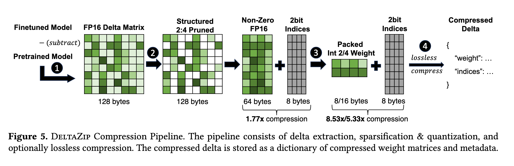

Paper link: https://dl.acm.org/doi/pdf/10.1145/3689031.3717468

An excellent paper on serving multiple fine-tuned models efficiently. Weight delta between models is a very intuitive idea but difficult to use effectively. This paper uses the niche that is fine-tuned models.

## Motivation

Setting:

Fine-tuned models are relevant. First, the paper (Figure 2) shows that full fine-tuning is relevant by showing it performs better than LoRA for certain tasks. 

Problem:
Serving fine-tuned models is not efficient since variants don't get much traffic. This leaves inference GPUs under-utilized (Figure 1 shows how infrequent requests arrive for variants). However spinning up an instance only when requests arrive is infeasible since it breaks the inference requests SLOs. Problem is how to serve fine-tuned models inference requests efficiently (in terms of GPU utilization) while maintaining latency of inference requests.

Opportunities:
1. Model deltas (fine-tuned model weights - base model weights) are easily compressible. Paper shows that fine-tuned models (this is where they are specific to fine-tuning) difference from base models is very small (in absolute values). Values fitting in a smaller range are easier to compress/quantize without loss. 
2. Sparse tensor cores can be used well with sparse matrices (that deltas end up being).
3. Batching requests to different fine-tuned models can only be done if base model serving and delta model serving are decoupled. This rules out solutions which would build the fine-tuned model by "adding" the base model to the delta at run-time, which was honestly what I thought the paper would do.

## System Architecture

The system has an offline and online component in its flow. The offline phase is when the model diff is calculated and stored. The online phase is when an inference request arrives and is served using the compressed model weights.

### Offline phase - Compression Algorithm

The Delta Compressor component compresses the model weights. The Figure 5 from the paper below explains the multiple steps in the process. This was a very interesting section with nuggets in each step.

First, they apply 2:4 structured pruning. In 2:4 pruning of a matrix, only 2 elements in every 4 elements are chosen. This directly results in 50% savings, with a 2-bit index matrix on which elements are chosen. This quantization does not only introduce sparsity, but has benefits computation-wise due to hardware efficiency, by leveraging the sparse tensor cores in GPUs. Then they do normal quantization which itself gives 4x compression. Finally they apply a lossless compression for fast decompression on GPUs.

There are 2 parameters/weights here - for the pruning and the quantization. The optimal parameters are chosen by using a calibration dataset that minimizes the loss between the compressed weights and actual weights.

### Online phase - Serving System

DeltaZip serves the base model and the delta model separately. The base model is always in memory and the deltas are swapped on-demand. Decoupling the base model is necessary so that they can batch requests to different fine-tuned models together efficiently. However the delta computation cannot be trivially batched. This is where they introduce their "Selective Batched Matrix Multiplication" which performs the matrix multiplication for different deltas together in a single kernel. 

Small contributions on top:
- Skip the line. Once a delta has been chosen for performing the SBMM, other requests using the same delta can skip the line and join, since batch size can be easily extended without introducing any extra latency.
- Tensor Parallelism support: Their approach can be easily extended for TP.
- LoRA support: While systems already exist for serving multiple LoRA adaptors simultaneously, they want a single unified system for all fine-tuning variants, hence also incorporate LoRA support.

## Extensive Evaluation

The paper has an extensive evaluation with atleast 20 graphs. Any aspect you think of has been covered and evaluated along with a few you never thought.

First, they have performance related results where they show that swapping models performs worse than their technique (which is sort of obvious).

Next, they compare against multi-LoRA adaptor serving frameworks and show equal performance for LoRA and obviously much better performance for Fine-tuning serving. 

In microbenchmarks, they show the performance of the SBMM kernel. Most interestingly, they show that post their proposed optimizations, the kernel scaled sub-linearly as the number of deltas increases (unlike other techniques which increase linearly/exponentially).

## Key Takeaways
1. Fine-tuned models weights are quite close to the base model weights, making the deltas easier to compress than the actual model weights itself. Quantization works well in these cases for 2 reasons. A more concentrated distribution results in a more concentrated quantization grid. Second, more zero values helps in better sparsified representation. These are quite interesting results (which I would like to reproduce locally as well). It is quite another thing to be able to use this information like the paper does.
2. The compression scheme that the paper introduces taught me a lot of new techniques and things. 2:4 sparsity which just removes elements (with the advantage of using sparse cores) as well as their quantization scheme. 
3. The serving section is yet another section where they introduce novel technical contributions. Serving the base model and the delta separately and then merging the results is not the first idea that comes to the mind. By introducing the SBMM, a kernel-level optimization, it immediately elevates this paper in my mind, since they give a complete end-to-end system solution.
4. The evaluation section was quite neat. In fact, the first time I read the paper, I understoon some of their technical stuff better only by trying to understand what each graph was trying to convey. A gold standard in how to  run microbenchmarks!

